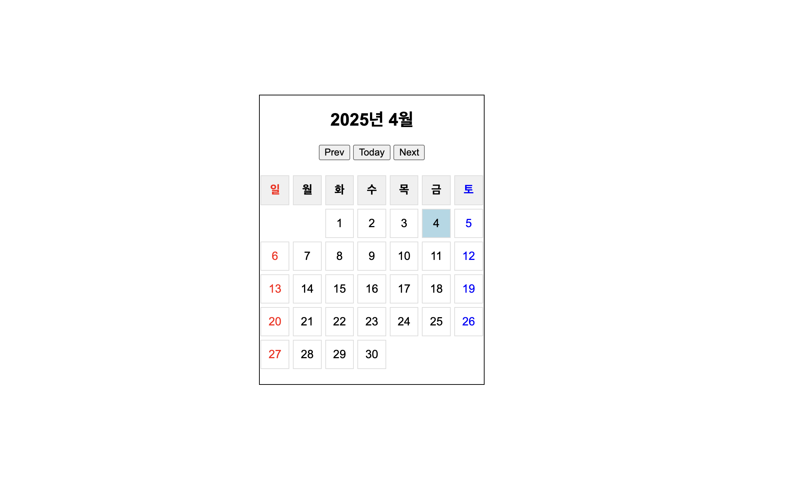

# Calendar

## Description
HTML, CSS, JavaScript를 활용하여 달력 제작

## 기능
- 월별 달력 표시
- today로 당일 날짜로 이동
- 우

## How To Use
1) repository 다운받기
```
git clone https://github.com/cogito30/js_calendar.git
```
2) index.html를 브라우저로 열기

## Result
