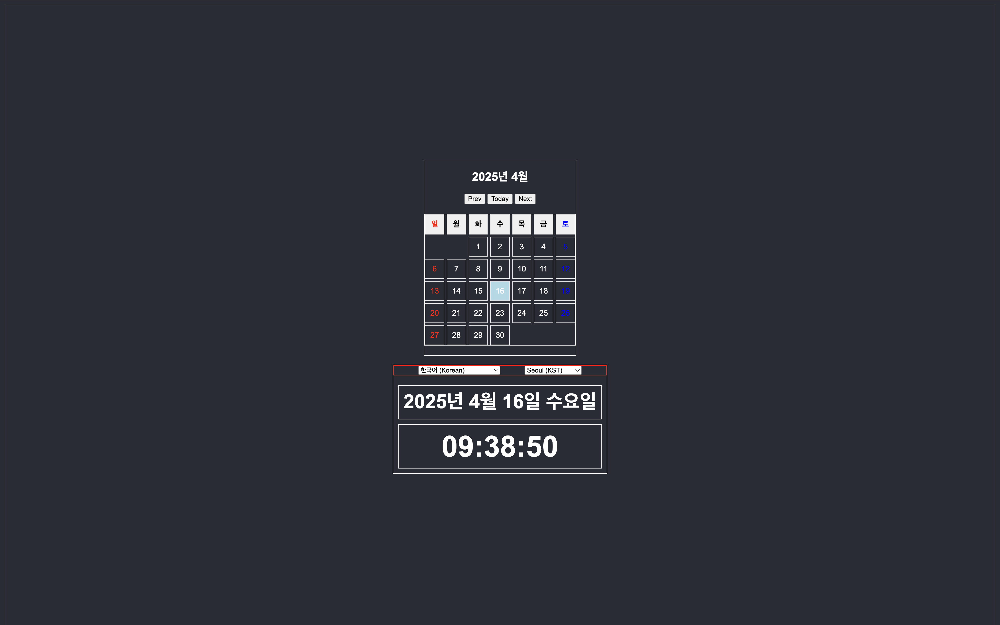

# Calendar

## Description
HTML, CSS, JavaScript를 활용하여 달력 제작

## 기능
- [v1](./calendar_v1/): 
- [v2](./): 
- [v3](): 

## How To Use
1) repository 다운받기
```
git clone https://github.com/cogito30/js_calendar.git
```
2) index.html를 브라우저로 열기

## Result


